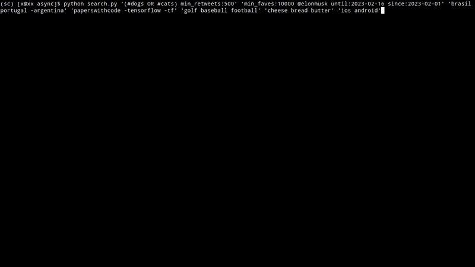

Fast twitter search using undocumented API



```bash
pip install twitter-async-search
```

### Example
```bash
twitter-async-search 'query1' 'query2' 
```
Search results are output to `~/data/raw`

### Notes
- ~400 search results rate limiting occurs

### References

https://developer.twitter.com/en/docs/twitter-api/v1/rules-and-filtering/search-operators

https://developer.twitter.com/en/docs/twitter-api/tweets/search/integrate/build-a-query
